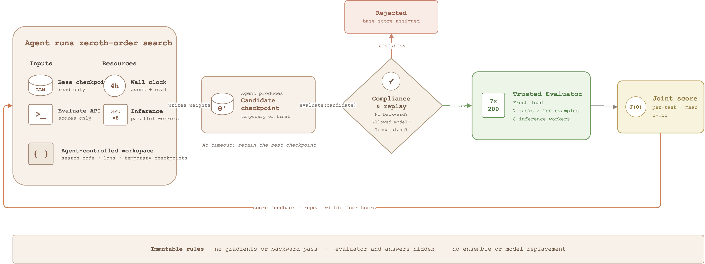

# PostTrainBench⁰

**Can LLM Agents Automate LLM Post-Training Without Gradients?**

[Read the bilingual research blog](https://zerogradbench-research.tanyuqiao669.chatgpt.site) ·
[Benchmark prompt](public/prompt.txt) ·
[Framework](docs/FRAMEWORK.md) ·
[Validity analysis](docs/RANDOMNESS_AND_VALIDITY.md)

PostTrainBench⁰ is a research preview for studying whether an LLM agent can
improve a real language model when backpropagation is unavailable. The agent
receives a frozen base checkpoint, two small zeroth-order starting methods, a
score-only evaluator, eight inference GPUs, and a four-hour wall-clock budget.
It may change the search code and evaluate intermediate candidates, but the
result must be one reloadable checkpoint.

> **Status:** this repository describes a working benchmark proposal and its
> pilot experiments. It is not yet a stable agent leaderboard. Repeat runs show
> that endpoint scores are strongly affected by search coverage and path luck.

## The question

PostTrainBench and RSIBench-Data ask agents to improve models through explicit
training. PostTrainBench⁰ keeps the research loop—hypothesis, implementation,
evaluation, revision—but removes gradients. This makes each experiment cheaper
and easier to replay while preserving a real model-editing problem.

The intended capability is not “sample random noise.” A capable agent should
use evaluation feedback to decide which directions to test, how far to move,
which task subsets to use as proxies, when to refine an incumbent, and how to
spend a finite evaluation budget.

## Benchmark contract

| Component | Current setting |
|---|---|
| Target models | Qwen2.5-3B-Instruct and Qwen3-4B-Base |
| Tasks | Countdown, GSM8K, MATH-500, OlympiadBench, MBPP, ROCStories, USPTO-50K |
| Evaluation view | 200 fixed examples per task; equal-weight mean on a 0–100 scale |
| Budget | Four hours, including agent reasoning, code execution, and evaluation |
| Compute | Eight GPUs used as independent inference workers, never as an ensemble |
| Agent output | One checkpoint that can be loaded and replayed in a fresh process |
| Forbidden | Gradients, backward passes, evaluator edits, model replacement, ensembles |

For a fixed checkpoint, evaluation is deterministic: the same examples,
greedy decoding, fixed generation seed, and exact weight restoration are used.
The main source of run-to-run variation is the *candidate set explored by the
agent*, not sampling noise inside the evaluator.

## What the agent receives

- [`public/prompt.txt`](public/prompt.txt): the shared task instruction and
  immutable rules.
- [`starter/randopt.py`](starter/randopt.py): independent random directions
  around the base model, retaining the best single candidate.
- [`starter/es.py`](starter/es.py): antithetic positive/negative probes and a
  score-difference center update.
- `bin/evaluate`, `bin/evaluate-batch`, `bin/results`, and `bin/status`:
  score-only commands supplied by the trusted runtime.

The starters are deliberately small. Agents may use, modify, combine, or
replace them. They do not expose task examples, labels, evaluator code, model
answers, or gradients.

## How one run works

[](docs/figures/posttrainbench0-system.pdf)

**Figure 1. PostTrainBench⁰ system design.** The agent controls the search code
and candidate construction. Every candidate passes a compliance check before a
trusted seven-task evaluation. Scores return to the agent during the four-hour
window; at timeout, the controller retains the best candidate that completed a
full-suite evaluation. The base checkpoint, evaluator, answers, and final
selection remain outside the writable workspace.

Figure source: [editable draw.io](docs/figures/posttrainbench0-system.drawio) ·
[vector PDF](docs/figures/posttrainbench0-system.pdf)

The trusted controller stores append-only attempt records and reloads the final
checkpoint in a fresh inference process. See
[`docs/FRAMEWORK.md`](docs/FRAMEWORK.md) for the visibility boundary.

## What the pilot experiments show

The experiments support two observations:

1. Better multi-task checkpoints exist near the tested pretrained weights. In
   the controlled Qwen3-4B study, 62 of 500 candidates exceeded the 41.08 base
   score; the best reached 46.03, while no candidate improved all seven tasks.
2. Agent runs produce different, inspectable search strategies, but their
   endpoint ordering is not stable. Across 51 four-hour runs, repeats of one
   agent setting differ by as much as 9.90 points.

The second result is central. A best-of-run score is an extreme statistic: it
rewards both search quality and the number of candidates evaluated. Direction
sampling, scale selection, incumbent path dependence, system throughput, and
repeated adaptation to the same development view are all mixed into the final
number. Read [`docs/RANDOMNESS_AND_VALIDITY.md`](docs/RANDOMNESS_AND_VALIDITY.md)
before interpreting the model tables as a ranking.

## Repository structure

```text
app/                             bilingual research blog and interactive figures
public/                          blog assets, plot data, and agent prompt
starter/
  randopt.py                     minimal random-search starting point
  es.py                          minimal antithetic ES starting point
data/derived/
  blog_run_summary.csv           grouped public snapshot of 51 completed runs
docs/
  FRAMEWORK.md                   agent-visible and trusted-system boundary
  RANDOMNESS_AND_VALIDITY.md     what varies and how results should be read
  EXPERIMENT_PROGRESS.md         evidence snapshot and current limitations
  figures/                       checked figures, draw.io source, and PDF export
scripts/                         data preparation and Python figure generation
tests/
  test_release_contract.py       benchmark-contract checks
  rendered-html.test.mjs         rendered-blog checks
```

Raw checkpoints, hidden evaluation examples, credentials, infrastructure
identifiers, unredacted traces, and historical protocol branches are
intentionally excluded. They remain in a separate private experiment archive.

Run the benchmark-contract checks:

```bash
python -m unittest discover -s tests -v
```

Build and verify the research blog:

```bash
npm install
npm test
```

## How to cite this preview

```bibtex
@misc{tan2026posttrainbench0,
  title  = {{PostTrainBench}$^{0}$: Can LLM Agents Automate LLM Post-Training Without Gradients?},
  author = {Tan, Yuqiao},
  year   = {2026},
  note   = {Research preview}
}
```
